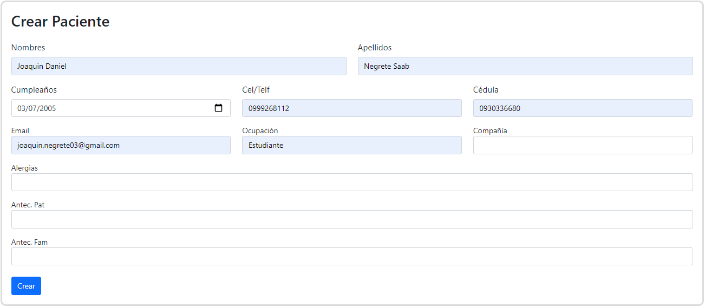
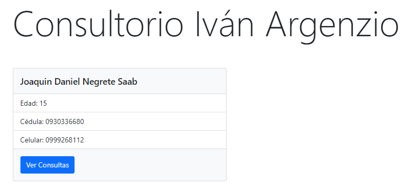
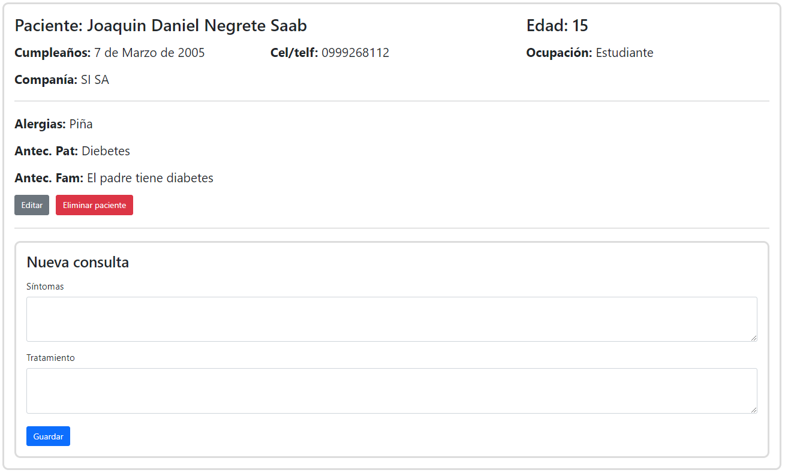
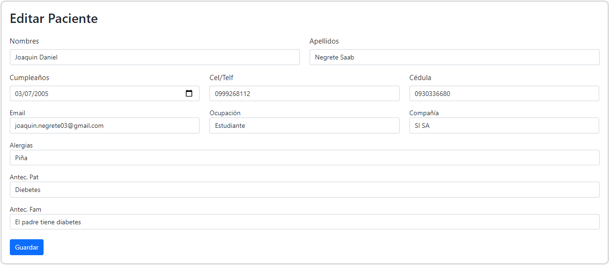

# Proyecto Consultorio Iván Argenzio

Escrito en Django. Proyecto que le permite al consultorio manejar a sus pacientes con sus consultas digitalmente.

## Manual

### Paginación

Primero encontrarás la página principal. Aquí se verá un listado de todos los pacientes, separados en grupos de 10. Es decir, cada 10 pacientes tendrás que avanzar de página.

### Barra superior

En la parte de más arriba encontrarás una barra de búsqueda en la que abrán varios links. A continuación explicaré cada uno de ellos.

- **Seleccionar Paciente:** Este botón simplemente llevará a la página principal.

- **Crear Paciente:** Este botón llevará a la página para crear un paciente.

- **Cerrar Sesión:** Este botón cerrará tu sesión. Irás a la página de Iniciar sesión automaticamente.

- **Barra de búsqueda:** Puede buscar pacientes por su apellido desde aquí.

#### Crear Paciente

A la hora de crear un paciente, encontrará varios campos, de los cuales deben ser llenados todos, hasta pero sin incluir, "Compañía". Es decir, los campos que pueden ser dejados ***sin llenar*** son:

1. Compañía
2. Alergias
3. Antec. Pat
4. Antec. Fam

Para terminar de crear a un paciente, le da al botón que dice "Crear"

### Página principal

Una vez que haya creado al menos 1 paciente, en la página principal podrá ver al paciente ahí.

Podrá ver información limitada sobre los pacientes. Para ver la información completa, simplemente haga click sobre la carta del paciente.

### Paciente específico

Dentro de esa página, podrá ver la información que registró del paciente

Revisemos la información paso a paso. Primero vemos información básica, nombre, edad, cel, etc. En el siguiente bloque, encontraremos información más médica, como alegias, antecedentes patológicos y familiares. Luego, si tiene autorización, podrá ver los botones de editar y eleminar paciente. 

### Editar paciente

La interfaz para editar a un paaciente es igual a la de crear uno, solo que tiene los campos pre-llenados.

Después de editar los campos que quiera, haga click en Guardar, y el paciente debería ser editado exitosamente, y será redireccionado a la página del paciente.

### Eliminar paciente

Para elminar, haga click en el botón rojo que dice "Eliminar Paciente", luego haga click en "Sí, estoy seguro". Si elimina el paciente, será redirigido a la página principal. Si decide cancelar, entonces no se eliminará, y seguirá en la página de detalle del paciente.

### Añadir consulta

En la página del paciente, podrá crear consultas. Para hacerlo, llene los campos, y luego ponga guardar. Una vez hecho esto, la página se refrescará, y verá la nueva consulta abajo, en un bloque diferente.
