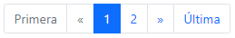
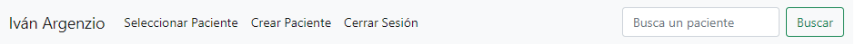

# Proyecto Consultorio Iván Argenzio

Escrito en Django. Proyecto que le permite al consultorio manejar a sus pacientes con sus consultas digitalmente.

## Manual

Primero encontrarás la página principal. Aquí se verá un listado de todos los pacientes, separados en grupos de 10. Es decir, cada 10 pacientes tendrás que avanzar de página.

En la parte de más arriba encontrarás una barra de búsqueda en la que abrán varios links. A continuación explicaré cada uno de ellos.

El primer link dice "Seleccionar Paciente". Este link simplemente llevará a la página principal.
